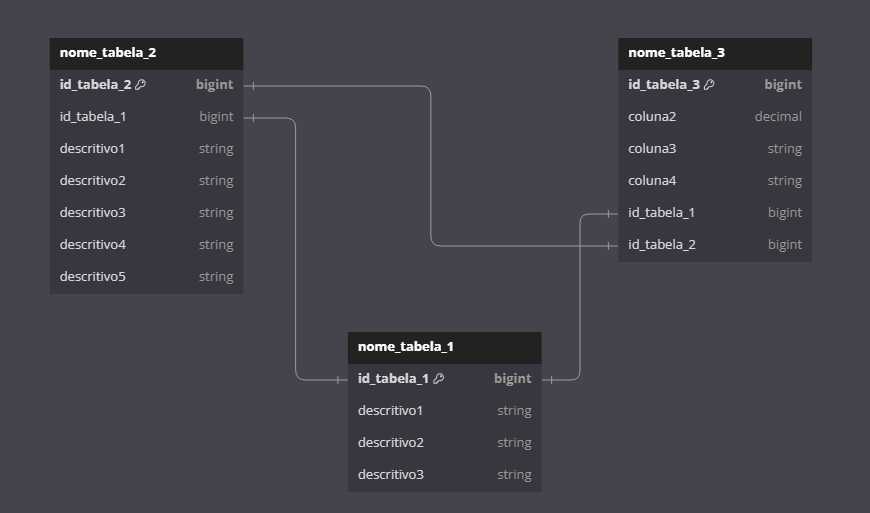

# Projeto do Modelo Ententidade Relacionamento 


Aplicação para gerar o modelo de entidade relacionamento com base em um database. 


```
Exemplo de Chamada 

python3 main.py "database" "EXEMPLO_relational_tables.json" "ER_EXEMPLO_20240907.txt"
```

database    - Corresponde ao Database no Amazon Glue. 

.json       - Corresponde ao Arquivo de configuração do JSON 


## Arquivo de Configuração JSON 

É apenas necessário explicitar apenas o nome da tabela que existe no 

Exemplo de JSON 
```json

{
    "nome_tabela_1": {
        "pk" : "id"

    },

    "nome_tabela_2" :{
        "pk" : "id",
        "fk" : "nome_tabela_1.id_tabela_1 - nome_tabela_2.id_tabela_1"
    },

    "nome_tabela_3" : {
        "pk" : "id",
        "fk" : "nome_tabela_1.id_tabela_1 - nome_tabela_3.id_tabela_1 | nome_tabela_2.id_tabela_2 - nome_tabela_3.id_tabela_2"
    }
}
```

### Pontos de Atenção sobre as Chaves

PK  - Corresponde a Primary Key da tabela. 

FK  - Corresponde ao relacionamento entre tabelas. 

"-" - Corresponde ao relacionamento da tabela, inicialmente apenas 1:1 está sendo esperado. 

"|" - Corresponde a separação de relacionamentos entre tabelas.


### Exemplo de Output
```plaintext
Table nome_tabela_1  { 
    id_tabela_1 bigint [primary key] 
    descritivo1 string  
    descritivo2 string  
    descritivo3 string  
}


Table nome_tabela_2  { 
    id_tabela_2 bigint [primary key] 
    id_tabela_1 bigint  
    descritivo1 string  
    descritivo2 string  
    descritivo3 string  
    descritivo4 string  
    descritivo5 string  
}

Ref: "nome_tabela_2"."id_tabela_1" - "nome_tabela_1"."id_tabela_1" 

Table nome_tabela_3  { 
    id_tabela_3 bigint [primary key] 
    coluna2 decimal  
    coluna3 string  
    coluna4 string  
    id_tabela_1 bigint  
    id_tabela_2 bigint  
}

Ref: "nome_tabela_3"."id_tabela_1" - "nome_tabela_1"."id_tabela_1" 
Ref: "nome_tabela_3"."id_tabela_2" - "nome_tabela_2"."id_tabela_2" 

```
### Modelo de ER (Entidade Relacionamento)

